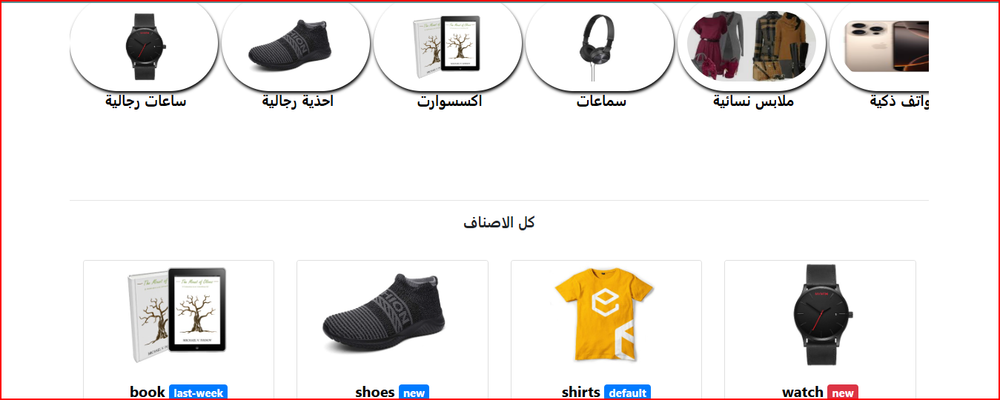

# 🛍️ متجر إلكتروني باستخدام Django و BATON

## نظرة عامة

هذا المشروع هو متجر إلكتروني تم تطويره باستخدام إطار العمل **Django** بلغة Python، وتم اعتماد لوحة التحكم **BATON** كواجهة مخصصة للإدارة بدلًا من لوحة Django التقليدية.

يوفر المتجر واجهات للمستخدمين لاستعراض المنتجات وإجراء عمليات الشراء، بالإضافة إلى لوحة تحكم للمسؤولين لإدارة المحتوى والطلبات والمستخدمين.

---

## ⚙️ التقنيات المستخدمة

- **Python 3.10+**
- **Django 4.x**
- **BATON Admin** (واجهة مخصصة لإدارة Django)
- **SQLite / PostgreSQL** (قابلة للتبديل)
- **HTML / CSS / JavaScript**
- **Bootstrap 5**
- **Django REST Framework** (اختياري)

---
User Interfaces


## 📦 تثبيت المشروع محليًا

### 1. استنساخ المستودع
```bash
git clone https://github.com/your-username/your-repo-name.git
cd your-repo-name
